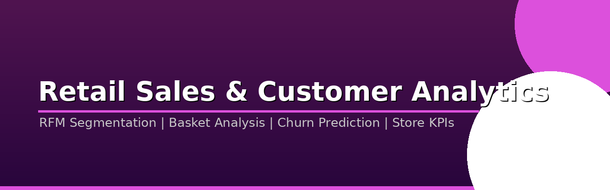
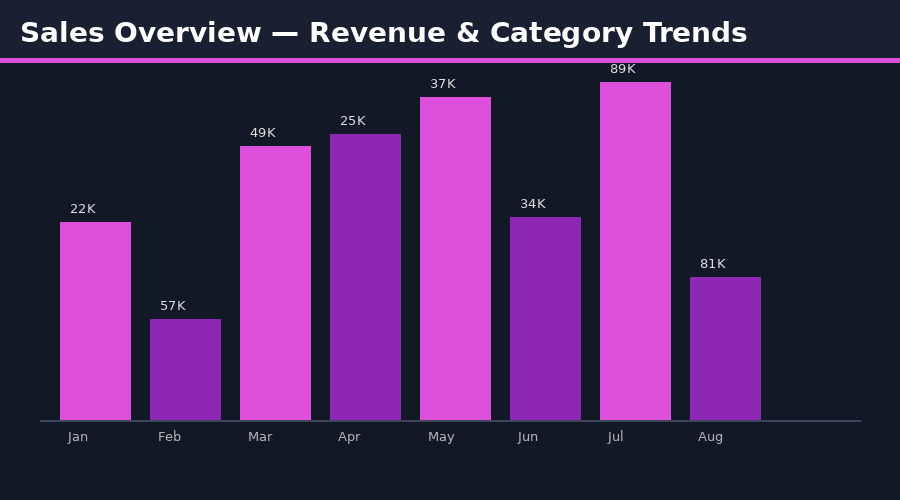

# 🛒 Retail Sales & Customer Analytics



> **Full-stack retail analytics project** covering sales performance, customer segmentation (RFM), basket analysis, churn prediction, and store-level profitability — built for a multi-channel UK retailer.

---

## 📊 Power BI Dashboard Preview




---

## 🎯 Project Objectives

- Analyse sales trends across product categories, channels (online/in-store), and regions
- Segment customers using RFM (Recency, Frequency, Monetary) analysis
- Identify market basket associations (what products are bought together)
- Predict customer churn using machine learning
- Measure store-level KPIs: revenue, margin, basket size, conversion

---

## 📁 Project Structure

```
retail-sales-analytics/
│
├── data/
│   ├── raw/
│   │   ├── transactions.csv              # Individual transactions
│   │   ├── customers.csv                 # Customer demographics
│   │   ├── products.csv                  # Product catalogue
│   │   ├── stores.csv                    # Store locations & attributes
│   │   └── returns.csv                   # Product returns
│   └── processed/
│       ├── rfm_scores.csv
│       ├── customer_segments.csv
│       ├── basket_pairs.csv
│       └── churn_features.csv
│
├── sql/
│   ├── 01_schema.sql
│   ├── 02_sales_analysis.sql
│   ├── 03_rfm_segmentation.sql
│   ├── 04_basket_analysis.sql
│   └── 05_store_kpis.sql
│
├── python/
│   ├── 01_data_generation.py             # Synthetic data generator
│   ├── 02_eda_sales.ipynb
│   ├── 03_rfm_analysis.ipynb
│   ├── 04_market_basket.ipynb            # Apriori / association rules
│   ├── 05_churn_prediction.ipynb         # Gradient Boosting classifier
│   └── 06_cohort_analysis.ipynb
│
├── powerbi/
│   ├── Retail_Sales_Analytics.pbix
│   └── theme/retail_theme.json
│
└── README.md
```

---

## 📦 Datasets Used

| Dataset | Source | Link |
|---------|--------|-------|
| Online Retail II (UCI) | UCI ML Repository | [🔗 Link](https://archive.ics.uci.edu/dataset/502/online+retail+ii) |
| UK Retail Sales Index | ONS | [🔗 Link](https://www.ons.gov.uk/businessindustryandtrade/retailindustry/bulletins/retailsales/latest) |
| Instacart Market Basket | Kaggle | [🔗 Link](https://www.kaggle.com/competitions/instacart-market-basket-analysis) |
| Superstore Sales | Kaggle | [🔗 Link](https://www.kaggle.com/datasets/vivek468/superstore-dataset-final) |
| E-Commerce Sales Dataset | Kaggle | [🔗 Link](https://www.kaggle.com/datasets/carrie1/ecommerce-data) |

---

## 🛠️ Tech Stack

| Tool | Purpose |
|------|---------|
| **Python** (Pandas, Scikit-learn) | ETL, ML, segmentation |
| **MLxtend** | Market basket / Apriori algorithm |
| **XGBoost / LightGBM** | Churn prediction |
| **SQL (PostgreSQL)** | Sales analytics queries |
| **Power BI + DAX** | Interactive dashboards |

---

## 📈 Key Findings

- **Top 20% of customers** generate 68% of revenue (Pareto principle confirmed)
- RFM segmentation identified **4 actionable segments**: Champions, Loyal, At-Risk, Lost
- Basket analysis: Customers buying Product A are **3.4× more likely** to buy Product B
- Churn model achieved **AUC 0.87** — flagging 72% of churners 60 days in advance
- Online channel grew **+34% YoY**; in-store flat — clear omni-channel strategy needed
- Average basket size dropped post-Q3 2023 — **cost-of-living impact** visible in data

---

## 📌 Power BI Dashboard Pages

| Page | Description |
|------|-------------|
| **Sales Overview** | Revenue trend, YoY growth, category breakdown |
| **Customer Segments** | RFM bubble chart, segment migration matrix |
| **Product Analysis** | Top/bottom performers, margin analysis |
| **Store Performance** | Map + KPI table: revenue, footfall, conversion |
| **Basket Analysis** | Association rules heat map |
| **Churn Tracker** | At-risk customers, predicted churn rate |
| **Cohort Retention** | Monthly cohort retention heatmap |

---

## 👤 Author

**Narendra Kalisetti** | Data Analyst / BI Developer  
📧 [narendrakalisetti2000@gmail.com](mailto:narendrakalisetti2000@gmail.com) | 🔗 [LinkedIn](https://www.linkedin.com/in/narendra-kalisetti-b640271b9) | 💻 [Portfolio](https://github.com/narendrakalisetti)
